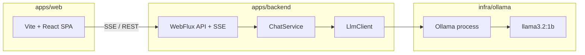
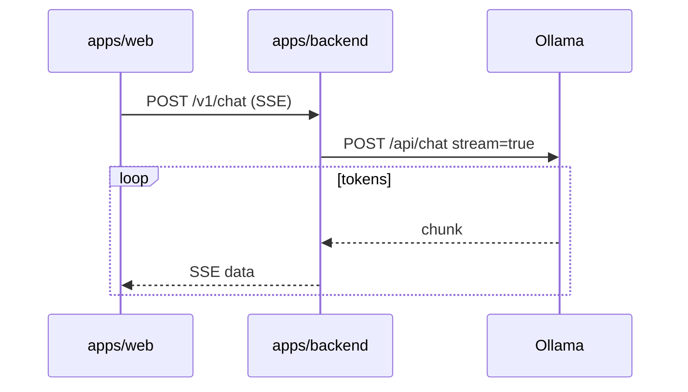

# 02 — Architecture

## System context



## Monorepo modules

| Path | Role |
|------|------|
| `apps/backend` | Spring WebFlux, `com.chatbot.backend`, port 8080 |
| `apps/web` | Chat UI, Vite dev :5173, proxies API to backend |
| `infra/ollama` | `pull-models.sh`, setup README |
| `gradle/libs.versions.toml` | Shared dependency versions |

## Logical components (backend)

### Chat API — `apps/backend/.../api/`

- `ChatController` — HTTP + SSE.
- CORS for `http://localhost:5173` — `config/WebConfig.java`.

### Chat service (planned)

- `ChatService` + `LlmClient` / `OllamaLlmClient`.

### Configuration

- `apps/backend/src/main/resources/application.yml` — `chat.llm.*`, `chat.cors.*`.

## Request flow



## Deployment (local dev)

| Process | Port | Start |
|---------|------|-------|
| Ollama | 11434 | `ollama serve` |
| Backend | 8080 | `./gradlew :apps:backend:bootRun` |
| Web UI | 5173 | `./gradlew :apps:web:npm_run_dev` |

```bash
ollama serve
./infra/ollama/pull-models.sh
./gradlew :apps:backend:bootRun
./gradlew :apps:web:npm_run_dev
```

## Repository layout

```
chatbot-webflux/
├── settings.gradle.kts
├── build.gradle.kts
├── gradle/libs.versions.toml
├── apps/
│   ├── backend/
│   │   ├── build.gradle.kts
│   │   └── src/main/java/com/chatbot/backend/
│   └── web/
│       ├── build.gradle.kts
│       ├── package.json
│       └── src/
├── infra/ollama/
└── docs/design/
```

## Failure handling

| Failure | Behavior |
|---------|----------|
| Ollama down | 503 / UI banner |
| Timeout | 504 / SSE error |
| Model missing | 502 + hint to run `pull-models.sh` |
